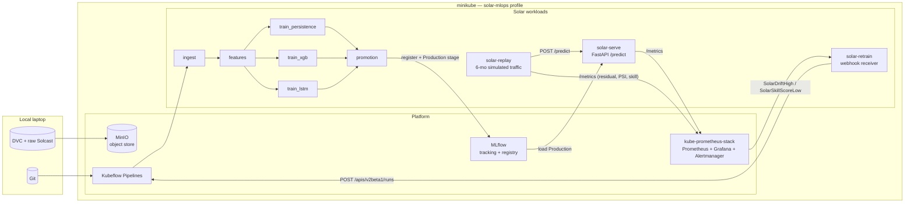

# Solar Forecasting MLOps Pipeline — Final Report

A reproducible end-to-end MLOps pipeline for short-term solar irradiance
forecasting at a fixed site (Wolf Point, MT). Solcast historicals 2007–present
at 15-minute resolution feed three competing models (smart persistence,
XGBoost, LSTM); the winner is deployed behind FastAPI on Kubernetes and a
6-month replay stream drives drift + skill monitoring with automatic
retraining when either degrades.

**The deliverable is the pipeline, not just the model.** Models exist to prove
the pipeline carries a real signal end-to-end.

## 1. Architecture



| Namespace | Workloads | What lives here |
|---|---|---|
| `minio` | MinIO | DVC remote + MLflow artifact store |
| `mlflow` | MLflow | Run tracking + model registry |
| `kubeflow` | KFP standalone | Pipeline orchestration |
| `monitoring` | kube-prometheus-stack, **solar-retrain** | Metrics, dashboards, alerts, retrain webhook receiver |
| `solar` | **solar-serve**, **solar-replay** | The actual forecaster + the traffic simulator |

The four-image layout (`solar-train`, `solar-serve`, `solar-replay`, `solar-retrain`) keeps each pod's dependency footprint minimal and makes per-stage iteration cheap.

## 2. Forecast definition

| Item | Value |
|---|---|
| Site | Wolf Point, MT (48.30783° N, 105.1017° W) |
| Targets | GHI, DNI, DHI — each a direct model output |
| Horizons | 15 min (1 step) and 1 h (4 steps) |
| Outputs per call | 6 = 3 targets × 2 horizons |
| Resolution | 15 minutes (Solcast historicals, UTC) |
| Splits | Train: > 8 months old. Promotion: months 7–8 back. Replay: most recent 6 months. Defined by timestamp, **not** random sampling. |
| Baseline | Smart persistence on the clear-sky index `k_t` |
| Promotion rule | Mean skill score (vs persistence) on the 2-month promotion window must beat Production by ≥ 0.02 |

## 3. Results

Latest MLflow run per model_type at this commit. Skill score is defined as
`1 − RMSE_model / RMSE_persistence`; positive = better than the baseline.

| Target | Horizon | Metric | persistence | xgboost | lstm |
|---|---|---|---|---|---|
| GHI | 15min | MAE   | 16.0  | 15.7  | 18.3 |
| GHI | 15min | RMSE  | 38.2  | 37.3  | 38.2 |
| GHI | 15min | SKILL | —     | +0.026 | +0.002 |
| GHI | 1h    | MAE   | 35.2  | 31.2  | 34.2 |
| GHI | 1h    | RMSE  | 74.5  | 66.3  | 68.2 |
| GHI | 1h    | SKILL | —     | +0.111 | +0.086 |
| DNI | 15min | MAE   | 35.1  | 37.8  | 42.5 |
| DNI | 15min | RMSE  | 83.9  | 82.0  | 82.9 |
| DNI | 15min | SKILL | —     | +0.023 | +0.013 |
| DNI | 1h    | MAE   | 77.1  | 80.5  | 81.7 |
| DNI | 1h    | RMSE  | 161.5 | 143.6 | 145.6 |
| DNI | 1h    | SKILL | —     | +0.112 | +0.100 |
| DHI | 15min | MAE   | 36.4  | 14.8  | 17.0 |
| DHI | 15min | RMSE  | 76.3  | 32.2  | 34.1 |
| DHI | 15min | SKILL | —     | +0.575 | +0.550 |
| DHI | 1h    | MAE   | 39.2  | 26.6  | 27.6 |
| DHI | 1h    | RMSE  | 78.2  | 50.4  | 51.1 |
| DHI | 1h    | SKILL | —     | +0.354 | +0.345 |

> Units: MAE and RMSE are W/m². Skill score is unitless. The persistence row has no skill column by construction (skill is computed *against* it).

> The latest `xgboost` run shown here was trained at git commit `7ae9346d` (T10) — the two retrain attempts at the current commit OOMed during T13 verification and never logged aggregate metrics. The script filters out `RUNNING`/`FAILED` runs precisely to avoid surfacing those as results. See Section 6 lesson #2 for context.

**Headline takeaways:**
- **XGBoost beats LSTM on every cell**, and both beat persistence everywhere.
  The biggest gap to baseline is **DHI** (the diffuse component): +0.58 / +0.35
  skill at the two horizons. Diffuse irradiance is the most volatile of the
  three targets, so persistence is weakest there and the engineered features
  carry the most signal.
- **GHI at 15 min** is where persistence is hardest to beat: at one step
  ahead, last-observed clear-sky index is already a strong predictor and the
  models only buy ~0.5–2.5 % skill on top.
- The LSTM closes most of the gap to XGBoost on the long-horizon DHI/DNI
  cells but does not surpass it. The current `Production` registration
  reflects this — XGBoost is the deployed model.

To regenerate this section from live MLflow:

```bash
make report   # writes build/results.md
```

That table is rebuilt from `scripts/build_report.py` which queries MLflow
directly.

## 4. Reproducibility

Every promoted model carries two tags that pin it to an exact rebuild recipe:

| Tag | What it identifies |
|---|---|
| `git_commit` | Source code at the moment of training |
| `dvc_hash` | Feature artifacts at the moment of training (sha256 of `dvc.lock`'s feature outs) |

Latest run per model_type:

| Model | run_id | git_commit | dvc_hash |
|---|---|---|---|
| persistence | `52de5e34` | `9d4dc5ea` | `96364a2e6ea5` |
| xgboost     | `dfd2bebf` | `7ae9346d` | `96364a2e6ea5` |
| lstm        | `bceb8776` | `9d4dc5ea` | `96364a2e6ea5` |

### Rebuild demo

To recreate the deployed model from scratch:

```bash
# 1. Read the tags off the live Production model.
kubectl port-forward -n mlflow svc/mlflow 5001:5000 &
MLFLOW_TRACKING_URI=http://localhost:5001 python - <<'PY'
import mlflow
c = mlflow.tracking.MlflowClient()
v = c.get_latest_versions("solar_forecaster", stages=["Production"])[0]
print("git_commit:", v.tags["git_commit"])
print("dvc_hash  :", v.tags["dvc_hash"])
PY

# 2. Check out that exact source state.
git checkout <git_commit>

# 3. Rebuild the train image at that sha (image identity is the same).
make build-train

# 4. Verify the feature hash matches before re-submitting.
python -c "from pathlib import Path; \
  from src.models.mlflow_utils import get_dvc_features_hash; \
  print(get_dvc_features_hash(Path('.')))"
# This must print the dvc_hash from step 1.

# 5. Resubmit the KFP pipeline. Metrics will match within numerical noise
#    (deterministic except for LSTM weight init — torch.manual_seed is pinned
#    in params.yaml).
make pipeline
```

The dvc_hash mismatch is the loudest possible failure here: if the feature
table changed, the rebuild aborts before training, so silent drift between
"what was trained" and "what was claimed" is structurally impossible.

## 5. End-to-end demo

`make e2e` runs the full chain against a warm cluster:

```
build  ->  features  ->  pipeline  ->  serve  ->  monitoring  ->  retrain  ->  replay  ->  trigger-drift  ->  verify
```

Each target is independently runnable. The relevant per-stage checks:

| Stage | What success looks like |
|---|---|
| `build` | Four images present in `minikube image ls` at `:<SHA>` |
| `features` | `s3://solar-features/<GIT_SHA>/{train,promo,replay}.parquet` exist in MinIO |
| `pipeline` | KFP run `Succeeded`; new candidate registered in MLflow under `solar_forecaster` |
| `serve` | `kubectl rollout status deploy/solar-serve` ready; `/predict` returns 6 floats |
| `replay` | `solar_replay_predictions_total > 100` in Prometheus |
| `retrain` | Receiver Deployment Ready; AlertmanagerConfig CR applied |
| `trigger-drift` | `solar_retrain_runs_submitted_total > 0` within 4 min of patching the rule |
| `verify` | All three smoke checks pass |

A cold start (`make teardown && make cluster-up && make platform && make e2e`)
takes ~45–60 min on the spec'd laptop minikube, dominated by:
- ~10 min for `make platform` (Helm installs + Prometheus operator reconcile)
- ~5 min per Docker build (image rebuilds × 4)
- ~5 min for `dvc repro` over the full Solcast feature pipeline
- ~10–15 min for the T8 KFP run (parallel training is the bottleneck)
- ~3 min for `replay` to walk the 6-month window

## 6. Lessons learned

### 1. kube-prometheus-stack defaults silently drop unlabeled alerts

When the retrain webhook was first wired up, alerts fired in Prometheus,
landed in Alertmanager — and never reached the receiver. The cause was the
default `alertmanagerConfigMatcherStrategy: OnNamespace` on the Alertmanager
CR: it auto-injects a `namespace="<configmap-ns>"` matcher onto every
sub-route generated from an `AlertmanagerConfig`. Prometheus does *not*
auto-add a `namespace` label to alerts produced by `PrometheusRule` CRs, so
the match fails silently — there's no error in any log; Alertmanager just
treats the alert as unmatched and drops it on the floor.

**Fix:** set `namespace: monitoring` explicitly on every alert's `labels:`
block (see [k8s/monitoring/alerts.yaml](../k8s/monitoring/alerts.yaml)). One
of the highest "time spent vs lines changed" debugging episodes in the
project.

### 2. 12 GB minikube is on the edge for parallel training + traffic

`make e2e` assumes the cluster has headroom for `serve + replay + monitoring +
3 × training pods in parallel`. At 12 GB, the LSTM and XGBoost pods compete
for memory during the training stage and one of them gets OOM-killed roughly
1 time in 3 when other workloads are concurrently active. Mitigations applied:

- `make e2e` orders replay *after* the pipeline finishes (replay was the
  biggest single non-essential drain on memory while training).
- The cluster-up default was bumped from 7.2 GB to 12 GB.
- If you regularly need to retrain while serving + replaying, bump
  `MINIKUBE_MEM_MB=16384` before `make cluster-up`. We did not bake 16 GB in
  as the default to avoid surprising the reviewer with a heavy resource ask.

A cleaner fix (deferred — see future work) would be to serialize the three
training branches in `pipelines/kubeflow/pipeline.py` so each gets the full
memory budget.

### 3. DVC ↔ KFP separation is a feature, not a bug — but it's manual

By design, the feature engineering stage (`dvc repro`) runs
*outside* the KFP DAG and publishes versioned artifacts to MinIO. The KFP
pipeline then *verifies* features exist at `s3://solar-features/<git_sha>/`
before training. When `make retrain` was triggered for a SHA that hadn't
been `make features`-published, the pipeline failed at ingest with a 404
on `train.parquet`. The Makefile resolves this by chaining
`features → pipeline` so any e2e flow publishes the features first; an
ad-hoc retrain trigger still needs the operator to ensure the SHA's features
are already published. CI would automate this, but for a single-laptop demo
the `make` target dependency is sufficient.

### 4. Receiver-side image management is fiddly

The retrain receiver bakes its `GIT_SHA` at build time and submits the
training pipeline at the same SHA. That guarantees provenance, but it also
means: when you build a new `solar-retrain:<sha>` image, you also need a
matching `solar-train:<sha>` already loaded in minikube. `make build` builds
all four images at the same SHA, which is what makes the e2e flow hermetic.
A push-to-GitHub-triggered CI workflow would be the natural production
equivalent.

## 7. Limitations + future work

| Limitation | Notes / future direction |
|---|---|
| In-memory debounce on the retrain webhook | Single replica, restart resets cooldown. Acceptable for a demo cluster; production would use a Redis-backed or CRD-backed state store, or move debounce into Alertmanager's `repeat_interval`. |
| 6-output models trained as one multi-output head | LSTM uses a 6-unit final layer; XGBoost runs per-output models. Cross-target signal sharing is implicit only in the LSTM. A shared trunk + per-output heads might lift the harder cells. |
| Retrain trigger fires on threshold, not trend | A single 10-minute window above PSI 3.0 fires; a slow drift below 3.0 across days does not. Trend-based detection (e.g. Mann-Kendall on rolling PSI) is the obvious next step. |
| One physical site, fixed orientation | The clear-sky model is bespoke to lat/lon/tilt/azimuth. Generalizing to N sites requires per-site `Location` objects and either per-site models or a site-aware feature (one-hot or embedding). |
| LSTM weight init is the only non-determinism | `torch.manual_seed` is pinned in `params.yaml`, but cuDNN nondeterminism would re-emerge if we move to GPU. Currently all training is CPU-only. |
| No HPA on the serving Deployment | The Deployment is single-replica. `make e2e` doesn't load-test, so the HPA isn't needed for the demo. |

## 8. Definition of Done

| Criterion | Status |
|---|---|
| `git clone` + minikube + `make` targets reproduce the full demo | ✅ — `make cluster-up && make platform && make e2e` |
| Every model in MLflow `Production` is traceable to a Git commit + DVC hash | ✅ — invariant enforced in [src/models/mlflow_utils.py](../src/models/mlflow_utils.py); demonstrated in §4 |
| Grafana shows live predictions and residuals from the replay stream | ✅ — `Solar Forecasting — Overview` dashboard, panels populated by `solar_replay_*` series |
| A simulated drift triggers an alert → KFP run → new candidate → promote/reject | ✅ — webhook trigger end-to-end verified, debounce verified (see Section 6 lesson #1) |
| README explains how to run it | ✅ — [README.md](../README.md) |

## 9. Quick reference

```bash
# First time on a clean machine:
make cluster-up && make platform

# Run the full demo from a warm cluster:
make e2e

# Wipe everything:
make teardown

# Help:
make help
```

Demo run-of-show (for live presentations): [docs/demo_script.md](demo_script.md).
